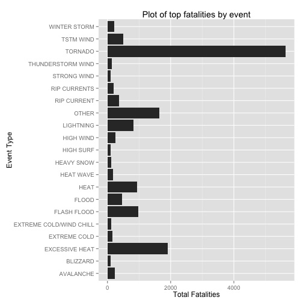
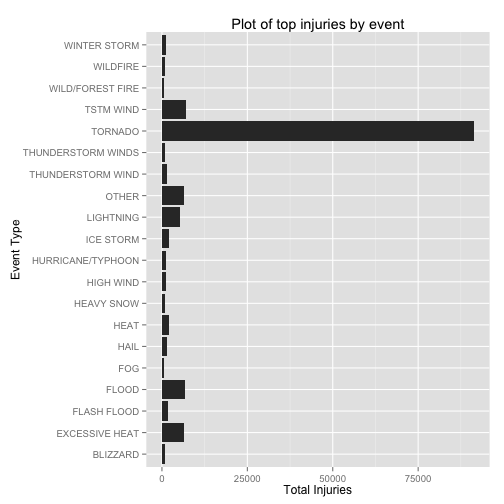
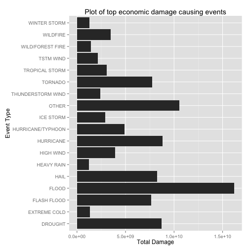

# Health and Economic Impacts of Storms in US

## Synopsis

In this report, we aim to analyse the economic and health consequences of Storms in USA. In particular, we address the following two questions:
1. Across the United States, which types of events are most harmful with respect to population health?
2. Across the United States, which types of events have the greatest economic consequences?

Our conclusion is that top event that causes most health damage(fatalities/injuries) is **TORNADO**. The top event that causes most economic damage (properties and crop related damages) is **FLOOD**.
## The Raw Data Source

The data for this report come in the form of a comma-separated-value file compressed via the bzip2 algorithm to reduce its size. You can download the file from the URL [Storm Data (47Mb)](https://d396qusza40orc.cloudfront.net/repdata%2Fdata%2FStormData.csv.bz2)

Following documentations give more details on how some of the variables are constructed/defined.

* [National Weather Service Storm Data Documentation]([an example](http://example.com/ "Title") inline link)
* National Climatic Data Center Storm Events [FAQ](https://d396qusza40orc.cloudfront.net/repdata%2Fpeer2_doc%2FNCDC%20Storm%20Events-FAQ%20Page.pdf)

The events in the database start in the year 1950 and end in November 2011. In the earlier years of the database there are generally fewer events recorded, most likely due to a lack of good records. More recent years are considered more complete for this report.

## Data Processing
We load the required libararies that we use throughout our analysis

```r
library(dplyr)
```

```
## 
## Attaching package: 'dplyr'
## 
## The following objects are masked from 'package:stats':
## 
##     filter, lag
## 
## The following objects are masked from 'package:base':
## 
##     intersect, setdiff, setequal, union
```

```r
library(xtable)
```

```
## Warning: package 'xtable' was built under R version 3.1.1
```

```r
library(stringr)
library(ggplot2)
```

```
## Find out what's changed in ggplot2 with
## news(Version == "1.0.0", package = "ggplot2")
```
We download the data and read the zip file into a variable *storm*

```r
download.file(
    "https://d396qusza40orc.cloudfront.net/repdata%2Fdata%2FStormData.csv.bz2",
    destfile="Storms.csv.bz2", 
    method="curl", 
    mode="wb")
storm <- read.csv(bzfile("Storms.csv.bz2"))
```

We then process the names of the data frame to lowercase and clean it up a bit

```r
names(storm)
```

```
##  [1] "STATE__"    "BGN_DATE"   "BGN_TIME"   "TIME_ZONE"  "COUNTY"    
##  [6] "COUNTYNAME" "STATE"      "EVTYPE"     "BGN_RANGE"  "BGN_AZI"   
## [11] "BGN_LOCATI" "END_DATE"   "END_TIME"   "COUNTY_END" "COUNTYENDN"
## [16] "END_RANGE"  "END_AZI"    "END_LOCATI" "LENGTH"     "WIDTH"     
## [21] "F"          "MAG"        "FATALITIES" "INJURIES"   "PROPDMG"   
## [26] "PROPDMGEXP" "CROPDMG"    "CROPDMGEXP" "WFO"        "STATEOFFIC"
## [31] "ZONENAMES"  "LATITUDE"   "LONGITUDE"  "LATITUDE_E" "LONGITUDE_"
## [36] "REMARKS"    "REFNUM"
```

```r
lowerCaseNames <- gsub("(.*)", "\\L\\1", names(storm), perl=TRUE)
finalNames = gsub( "__",'', lowerCaseNames)
finalNames = gsub( "_$",'', finalNames)
names(storm) = finalNames
names(storm)
```

```
##  [1] "state"      "bgn_date"   "bgn_time"   "time_zone"  "county"    
##  [6] "countyname" "state"      "evtype"     "bgn_range"  "bgn_azi"   
## [11] "bgn_locati" "end_date"   "end_time"   "county_end" "countyendn"
## [16] "end_range"  "end_azi"    "end_locati" "length"     "width"     
## [21] "f"          "mag"        "fatalities" "injuries"   "propdmg"   
## [26] "propdmgexp" "cropdmg"    "cropdmgexp" "wfo"        "stateoffic"
## [31] "zonenames"  "latitude"   "longitude"  "latitude_e" "longitude" 
## [36] "remarks"    "refnum"
```

Since the evtype (event type) column is central to our analysis, we clean it up by ensuring that we trim leading and ending spaces and replace multiple spaces with a single space to normalize the value.

```r
# print number of distinct event values before we normalize
nrow(storm%>%group_by(evtype) %>%summarize())
```

```
## [1] 985
```

```r
# replace multiple spaces with single space, remove leading/trailing spaces
storm$evtype = sapply(gsub("[ ]+", " ", storm$evtype), str_trim)
# print number of distinct event values after we normalize
nrow(storm%>%group_by(evtype) %>%summarize())
```

```
## [1] 970
```
This reduces the number of distinct evtype values from **985** to **970**.

### Health Impacts Analysis
To analyaze the health impacts of the storms based on event type, we assume that the main health impacts are represented by the columns *fatalities* and *injuries*. So we do sum up fatalities and injuries and sort them in descending order of number of fatalities and injuries

```r
storm_health_impact <- storm %>% group_by(evtype) %>% 
    summarize(total_fatalities = sum(fatalities),
              total_injuries=sum(injuries)
              )%>% 
    arrange(desc(total_fatalities), 
            desc(total_injuries) )
head(storm_health_impact, 5)
```

```
## Source: local data frame [5 x 3]
## 
##           evtype total_fatalities total_injuries
## 1        TORNADO             5633          91346
## 2 EXCESSIVE HEAT             1903           6525
## 3    FLASH FLOOD              978           1777
## 4           HEAT              937           2100
## 5      LIGHTNING              816           5230
```
From this we can conclude that the event **"TORNADO"** has the biggest impact in terms of health in USA

We would like to compare relative values of each event's impact on health. Since there are 970 different event types, we will simplify our analysis. We club all events that have fatalities < 100, into "OTHER" evtype category. Following R code does this:

```r
storm_top_fatalities <- storm_health_impact %>% filter(total_fatalities >=100)
storm_other = storm_health_impact %>% filter(
    total_fatalities < 100) %>% summarize(total_fatalities=sum(total_fatalities),
                                        total_injuries=sum(total_injuries))
storm_other <- cbind("OTHER", storm_other)
names(storm_other) <- names(storm_top_fatalities)
storm_summarized <- rbind(storm_top_fatalities, storm_other)
```
We then plot the fatalities against event type.

```r
ggplot(data=storm_summarized, aes(x=evtype, y=total_fatalities)) + 
    geom_bar(stat="identity") + coord_flip() + 
    ylab("Total Fatalities") + xlab("Event Type") + 
    ggtitle("Plot of top fatalities by event")
```

 
#### Figure 1: Plot of top events causing fatalities against number of fatalities
We conclude that the top damaging event TORNADO isalmost 3 times as damaging in terms of fatalities as the next top event (EXCESSIVE HEAT).

We do a similar analysis on injuries, clubbing all injuries >= 500 into the categories OTHER.


```r
storm_top_injuries <- storm_health_impact %>% filter(total_injuries >=500)
storm_other = storm_health_impact %>% filter(
    total_injuries < 500) %>% summarize(total_fatalities=sum(total_fatalities),
                                        total_injuries=sum(total_injuries))
storm_other <- cbind("OTHER", storm_other)
names(storm_other) <- names(storm_top_injuries)
storm_summarized <- rbind(storm_top_injuries, storm_other)
```

We plot the injuries against event type.

```r
ggplot(data=storm_summarized, aes(x=evtype, y=total_injuries)) + 
    geom_bar(stat="identity") + coord_flip() + 
    ylab("Total Injuries") + xlab("Event Type") + 
    ggtitle("Plot of top injuries by event")
```

 
#### Figure 2: Plot of top events causing injuries against number of injuries
We notice that the top event (TORNADO) is almost 14 times as damaging compared to the second event (EXCESSIVE HEAT) (excluding the "OTHER" category).

### Economic Impact Analysis

For economic impact analysis, we consider four variables:
propdmg, propdmgexp - these represent the property damage estimates
cropdmg, cropdmgexp - these represent the crop damage estimates

The propdmgexp and cropdmgexp tell us how to interpret the damage. Let us see what values these two columns have:

```r
storm %>% group_by(cropdmgexp) %>%summarize()
```

```
## Source: local data frame [9 x 1]
## 
##   cropdmgexp
## 1           
## 2          ?
## 3          0
## 4          2
## 5          B
## 6          k
## 7          K
## 8          m
## 9          M
```

```r
storm %>% group_by(propdmgexp) %>%summarize()
```

```
## Source: local data frame [19 x 1]
## 
##    propdmgexp
## 1            
## 2           -
## 3           ?
## 4           +
## 5           0
## 6           1
## 7           2
## 8           3
## 9           4
## 10          5
## 11          6
## 12          7
## 13          8
## 14          B
## 15          h
## 16          H
## 17          K
## 18          m
## 19          M
```
We explore the values of the propdmgexp/cropdmgexp in case they are "", "+", "-" or"?" to see what we can assume.

```r
storm %>% filter(propdmgexp=="?" | propdmgexp=="" | 
                     propdmgexp=="-" | propdmgexp=="+") %>% group_by(
                         propdmg, propdmgexp) %>% summarize(n())
```

```
## Source: local data frame [21 x 3]
## Groups: propdmg
## 
##    propdmg propdmgexp    n()
## 1     0.00            465858
## 2     0.00          ?      8
## 3     0.41                 1
## 4     1.00                 4
## 5     2.00                 7
## 6     2.00          +      1
## 7     3.00                16
## 8     4.00                 9
## 9     5.00                11
## 10    6.00                 6
## 11    7.00                 3
## 12    8.00                 2
## 13    9.00                 3
## 14   10.00                 8
## 15   15.00          -      1
## 16   15.00          +      1
## 17   20.00                 4
## 18   20.00          +      2
## 19   35.00                 1
## 20   60.00          +      1
## 21   75.00                 1
```

```r
storm %>% filter(cropdmgexp=="?" | 
                     cropdmgexp=="") %>% group_by(
                         cropdmg, cropdmgexp) %>% summarize(n())
```

```
## Source: local data frame [4 x 3]
## Groups: cropdmg
## 
##   cropdmg cropdmgexp    n()
## 1       0            618410
## 2       0          ?      7
## 3       3                 1
## 4       4                 2
```
We interpret the values of propdmgexp and cropdmgexp as follows:
* If the value of propdmgexp or cropdmgexp is ?, "+", "-" or ""(blank) then, the exponent is 1. Given the numbers above, these assumptions should not have any significant impact on our calculations.
* if the value is "h" or "H" then we multiply propdmg/cropdmg by 10^2 (10 raised to the power 2)
* if the value is "k" or "K" then we multiply propdmg/cropdmg by 10^3 (10 raised to the power 3)
* if the value is "m" or "M" then we multiply propdmg/cropdmg by 10^6 (10 raised to the power 6)
* if the value is "B" or "b" then we multiply propdmg/cropdmg by 10^9 (10 raised to the power 9)

We then write a function that gives us the absolute value of a damage given the damage number and the exponent and apply that function to calculate property damages and crop damages by event. We sort these by descending values of damages to get the top events that cause the most economic damage.

```r
absoluteDollarValue <- function (damage, exponent) {
    exponent = tolower(str_trim(exponent))
    if (identical(exponent,"h")) {
      damage * 100
    } else if (identical(exponent,"k")) {
      damage * 1000
    } else if (identical(exponent,"m")) {
      damage * 1000000
    } else if (identical(exponent,exponent == "b")) {
      damage * 1000000000
    } else {
      damage
    }
}

total_damage <- storm %>% group_by(
    evtype, propdmg, propdmgexp, cropdmg, cropdmgexp) %>% summarize(
        totalpropdmg=sum(absoluteDollarValue(propdmg,propdmgexp)), 
        totalcropdmg=sum(absoluteDollarValue(cropdmg,cropdmgexp)))
# sum up total damage and sort them in descending order of damage
total_damage_by_event <- total_damage %>% group_by(evtype) %>% summarize(totaldmg=sum(totalpropdmg+totalcropdmg)) %>% arrange(desc(totaldmg))
# print top 10
head(total_damage_by_event, 10)
```

```
## Source: local data frame [10 x 2]
## 
##               evtype    totaldmg
## 1              FLOOD 16178766094
## 2          HURRICANE  8803202150
## 3            DROUGHT  8713151452
## 4               HAIL  8260248538
## 5            TORNADO  7758095031
## 6        FLASH FLOOD  7662833022
## 7  HURRICANE/TYPHOON  4903672907
## 8          HIGH WIND  3939805068
## 9           WILDFIRE  3453086769
## 10    TROPICAL STORM  3069087567
```

From this we can conclude that the event **"FLOOD"** has the biggest economic impact in USA.

We would like to compare relative values of each event's impact on economy. Since there are 970 different event types, we will simplify our analysis. We club all events that have damajex < 1 billion, into "OTHER" evtype category. Following R code does this:

```r
storm_top_damage <- total_damage_by_event %>% filter(totaldmg >= 1000000000)
storm_other = total_damage_by_event %>% filter(
    totaldmg < 1000000000) %>% summarize(totaldmg=sum(totaldmg))
storm_other <- cbind("OTHER", storm_other)
names(storm_other) <- names(storm_top_damage)
storm_summarized <- rbind(storm_top_damage, storm_other)
```
We then plot the fatalities against event type.

```r
ggplot(data=storm_summarized, aes(x=evtype, y=totaldmg)) + 
    geom_bar(stat="identity") + coord_flip() + 
    ylab("Total Damage") + xlab("Event Type") + 
    ggtitle("Plot of top economic damage causing events")
```

 
#### Figure 3: Plot of top economic damage causing events

We note that the top event (flood) is almost twice as damaging as the next event excluding the "OTHER" category(DROUGHT).

## Results
Assuming that injuries and fatalities represent the main impact on health, we can see that the event **TORNADO** has the biggest impact on the USA by far. The next event in this list is **EXCESSIVE HEAT**.


```r
top_10 = head(storm_health_impact,10)
names(top_10) <- c("Event Type", "Fatalities", "Injuries")
#kable(top_10)
print(xtable(top_10), type="html")
```

<!-- html table generated in R 3.1.0 by xtable 1.7-4 package -->
<!-- Mon Oct 20 09:47:32 2014 -->
<table border=1>
<tr> <th>  </th> <th> Event Type </th> <th> Fatalities </th> <th> Injuries </th>  </tr>
  <tr> <td align="right"> 1 </td> <td> TORNADO </td> <td align="right"> 5633.00 </td> <td align="right"> 91346.00 </td> </tr>
  <tr> <td align="right"> 2 </td> <td> EXCESSIVE HEAT </td> <td align="right"> 1903.00 </td> <td align="right"> 6525.00 </td> </tr>
  <tr> <td align="right"> 3 </td> <td> FLASH FLOOD </td> <td align="right"> 978.00 </td> <td align="right"> 1777.00 </td> </tr>
  <tr> <td align="right"> 4 </td> <td> HEAT </td> <td align="right"> 937.00 </td> <td align="right"> 2100.00 </td> </tr>
  <tr> <td align="right"> 5 </td> <td> LIGHTNING </td> <td align="right"> 816.00 </td> <td align="right"> 5230.00 </td> </tr>
  <tr> <td align="right"> 6 </td> <td> TSTM WIND </td> <td align="right"> 504.00 </td> <td align="right"> 6957.00 </td> </tr>
  <tr> <td align="right"> 7 </td> <td> FLOOD </td> <td align="right"> 470.00 </td> <td align="right"> 6789.00 </td> </tr>
  <tr> <td align="right"> 8 </td> <td> RIP CURRENT </td> <td align="right"> 368.00 </td> <td align="right"> 232.00 </td> </tr>
  <tr> <td align="right"> 9 </td> <td> HIGH WIND </td> <td align="right"> 248.00 </td> <td align="right"> 1137.00 </td> </tr>
  <tr> <td align="right"> 10 </td> <td> AVALANCHE </td> <td align="right"> 224.00 </td> <td align="right"> 170.00 </td> </tr>
   </table>
#### Table 1: Top 10 Event Types causing fatalities and Injuries

From the table below, we can see that the event **FLOOD** has the biggest impact on the USA by far. The next event in this list is **HURRICANE**.


```r
top_10 = head(total_damage_by_event,10)
names(top_10) <- c("Event Type", "Total Damage")
#kable(top_10)
print(xtable(top_10), type="html")
```

<!-- html table generated in R 3.1.0 by xtable 1.7-4 package -->
<!-- Mon Oct 20 09:47:32 2014 -->
<table border=1>
<tr> <th>  </th> <th> Event Type </th> <th> Total Damage </th>  </tr>
  <tr> <td align="right"> 1 </td> <td> FLOOD </td> <td align="right"> 16178766094.35 </td> </tr>
  <tr> <td align="right"> 2 </td> <td> HURRICANE </td> <td align="right"> 8803202149.70 </td> </tr>
  <tr> <td align="right"> 3 </td> <td> DROUGHT </td> <td align="right"> 8713151452.38 </td> </tr>
  <tr> <td align="right"> 4 </td> <td> HAIL </td> <td align="right"> 8260248537.66 </td> </tr>
  <tr> <td align="right"> 5 </td> <td> TORNADO </td> <td align="right"> 7758095031.38 </td> </tr>
  <tr> <td align="right"> 6 </td> <td> FLASH FLOOD </td> <td align="right"> 7662833022.50 </td> </tr>
  <tr> <td align="right"> 7 </td> <td> HURRICANE/TYPHOON </td> <td align="right"> 4903672907.01 </td> </tr>
  <tr> <td align="right"> 8 </td> <td> HIGH WIND </td> <td align="right"> 3939805068.31 </td> </tr>
  <tr> <td align="right"> 9 </td> <td> WILDFIRE </td> <td align="right"> 3453086769.14 </td> </tr>
  <tr> <td align="right"> 10 </td> <td> TROPICAL STORM </td> <td align="right"> 3069087567.45 </td> </tr>
   </table>
#### Table 2: Top 10 Event Types causing economic damage
